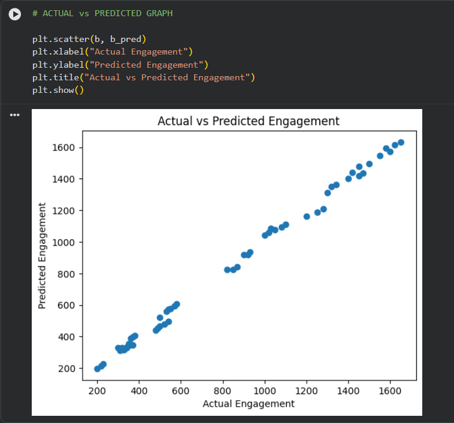
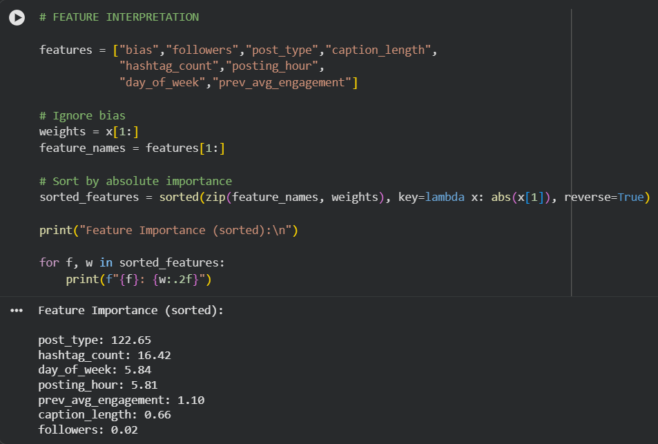
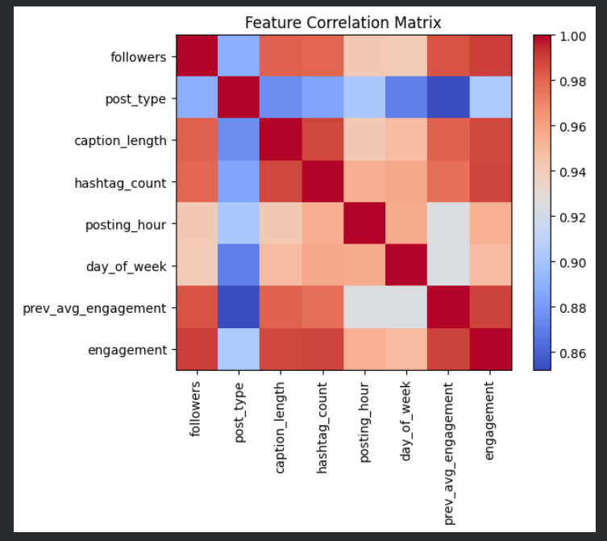
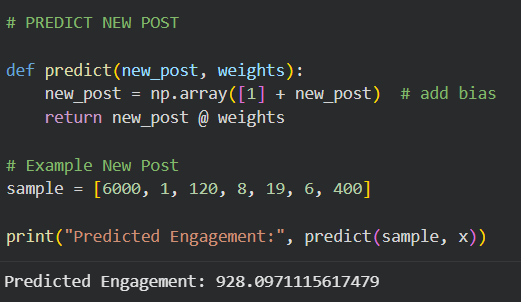
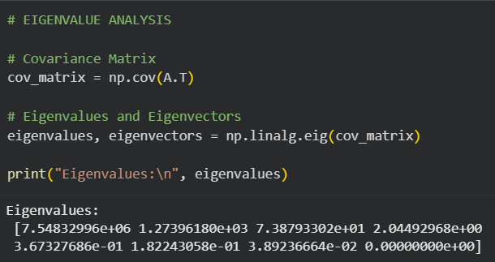

# Gramatrix 📊

**Instagram Engagement Pattern Analysis and Prediction using Linear Algebra**

---

## 🎯 Overview

Gramatrix is a Linear Algebra-based project that analyzes Instagram engagement data and predicts the performance of new posts using matrix operations.

The project models real-world engagement data as a system of linear equations and applies mathematical concepts to extract meaningful insights and make predictions.

---

## 🧠 Objective

* Identify key factors influencing engagement
* Detect and analyze redundancy in features
* Discover dominant engagement patterns
* Predict engagement of new Instagram posts

---

## 🧮 Mathematical Model

We model the system as:

[
Ax \approx b
]

* **A** → Feature matrix (followers, hashtags, etc.)
* **x** → Weights (importance of each feature)
* **b** → Actual engagement

We compute the optimal weights using Least Squares:

[
x = (A^T A)^{-1} A^T b
]

---

## 🔄 Project Pipeline

1. Load real-world dataset
2. Convert data into matrix form
3. Apply Gaussian Elimination (RREF)
4. Analyze rank and linear independence
5. Detect redundancy using correlation
6. Apply Gram-Schmidt orthogonalization
7. Compute least squares solution
8. Perform projection (Ax ≈ b)
9. Evaluate error (Mean Squared Error)
10. Visualize results
11. Perform eigenvalue analysis

---

## 📊 Results

* Reels (post_type) have the highest impact on engagement
* Hashtags significantly improve engagement
* Previous engagement strongly influences future performance
* Posting time moderately affects reach
* The model shows strong prediction accuracy

---

## 📸 Results Visualization

### 📊 Model Performance (Actual vs Predicted)



### 🧮 Feature Importance



### 📈 Correlation Matrix



### 🔮 Prediction Example



### 🔢 Eigenvalue Analysis



---

## 🔮 Prediction

The model predicts engagement for new posts using:

[
\hat{b} = A_{new} \cdot x
]

### Example Input:

```python
[6000, 1, 120, 8, 19, 6, 400]
```

### Output:

```
Predicted Engagement ≈ 928
```

---

## 📁 Project Structure

```
gramatrix/
│
├── data/
│   └── instagram_data.csv
│
├── screenshots/
│   ├── graph.png
│   ├── weights.png
│   ├── correlation.png
│   ├── prediction.png
│   └── eigen.png
│
├── gramatrix.ipynb
├── README.md
└── requirements.txt
```

---

## ⚙️ Requirements

* Python
* NumPy
* Pandas
* Matplotlib
* SymPy

Install dependencies:

```bash
pip install numpy pandas matplotlib sympy
```

---

## 🚀 How to Run

1. Open the notebook in VS Code or Google Colab
2. Upload `instagram_data.csv`
3. Run all cells
4. View outputs and predictions

---

## 🎤 Key Concepts Used

* Matrix Representation
* Gaussian Elimination (RREF)
* Rank and Linear Independence
* Gram-Schmidt Orthogonalization
* Least Squares Approximation
* Projection onto Subspace
* Eigenvalues and Eigenvectors

---

## 💡 Conclusion

Gramatrix demonstrates how Linear Algebra can be applied to real-world data analysis.
It transforms raw Instagram metrics into meaningful insights and enables prediction of engagement using mathematical modeling.

---

## License

[MIT](./LICENSE)

---

Built by [Jashruth K A](https://github.com/jashruth-k-a) 
